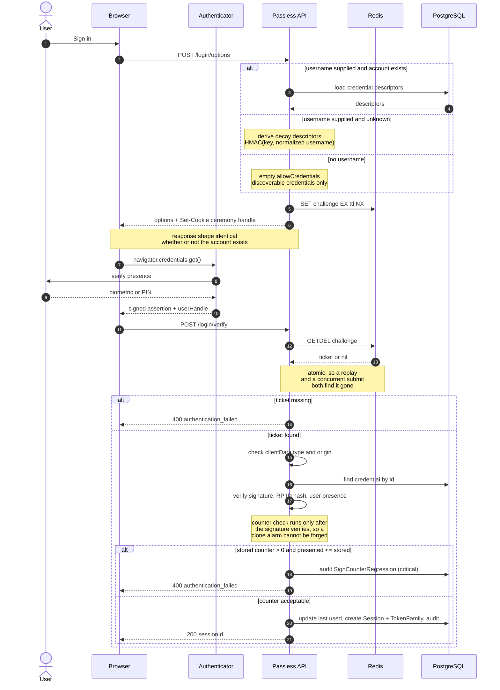

# Assertion ceremony

How `POST /login/options` and `POST /login/verify` fit together, and where each
security control sits.

## Notes on the diagram

**Decoys.** Asking for options with a username that does not exist returns
derived descriptors rather than an empty list, so the response cannot be used to
test whether an account exists. Derived rather than random, so asking twice does
not separate the invented from the real.

**Atomic consumption.** The challenge is fetched and destroyed by a single
`GETDEL`. A read followed by a delete would let two concurrent submissions both
observe the ticket.

**Order of the counter check.** The signature is verified first, deliberately.
If the counter rule ran first, anyone could post an unsigned response with a low
counter and make the server raise a critical "possible cloned authenticator"
event about a credential they do not hold. An alarm anybody can trigger is not
an alarm.

**Counter zero.** A credential whose stored counter is zero is never held to a
counter. Most synced passkey providers never increment one, because the
credential is designed to live on several devices at once; a strict monotonic
rule would lock out the common case and catch nobody.

**One response for every failure.** A stale challenge, an unknown credential, a
disabled account and a cloned authenticator all return the same body. The
distinction is in the audit log.
